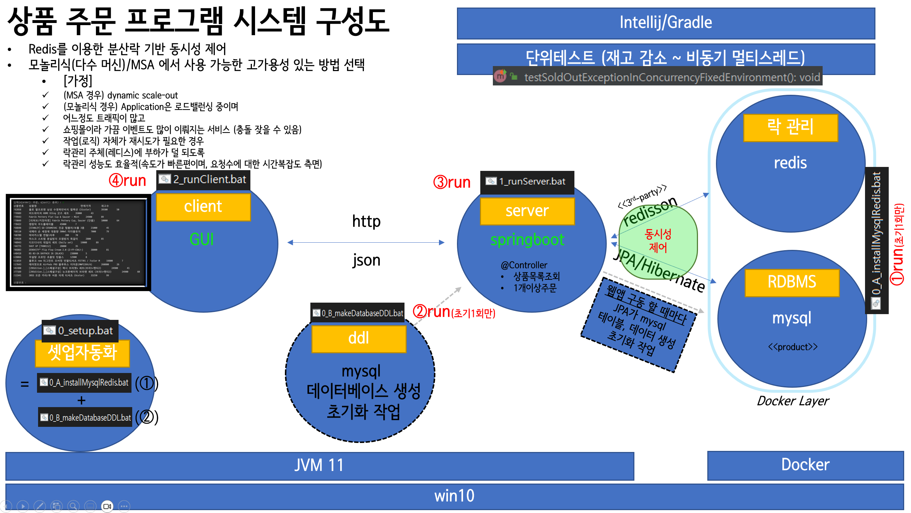
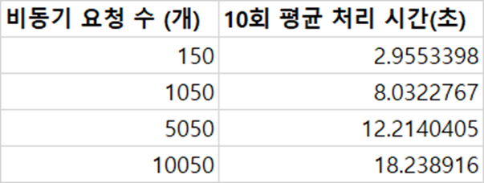
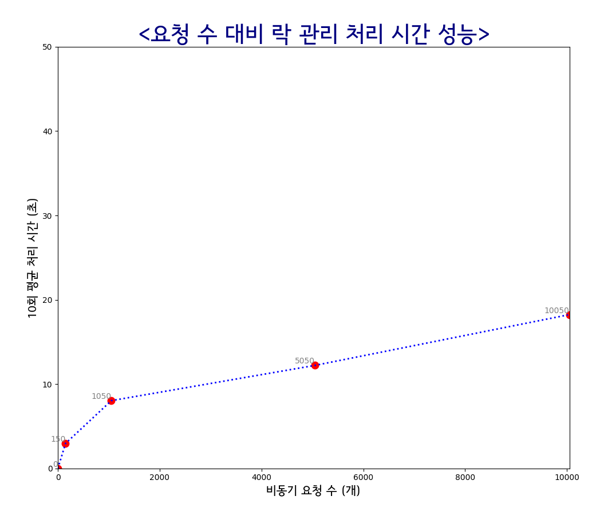
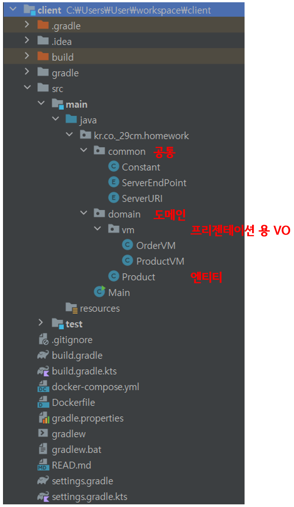
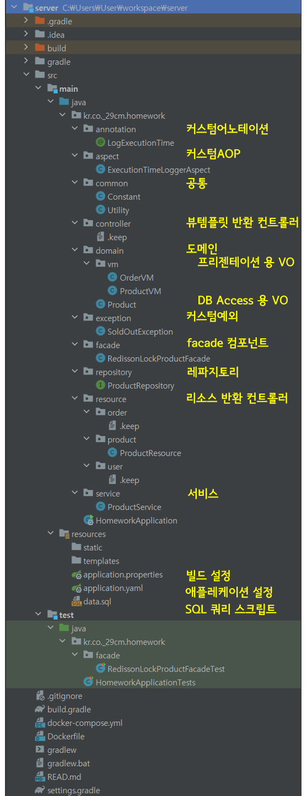

# 상품 주문 프로그램 

## ※ 공통설명
### 프로젝트 구성 (3가지)
* 1. `ddl`: 로컬 구동 위한 준비 과정중 mysql 데이터베이스 생성하는 jdbc 배치프로그램 (최초 셋업에서 1회만 수행)
* 2. `server`: 로컬 구동 위한 스프링부트앱 기반 API 
* 3. `client`: 로컬 구동 위한 콘솔프로그램

### 시스템 구성도

### 저는 상품 주문 프로젝트를 수행하면서 이러한 `주안점`을 두고 개발하였습니다
* 기능 구현 시 동시성 이슈가 발생되어 이를 해결하고자 했다.
* 동시성 관리가 핵심 문제라고 정의하였다.
* 이에 대해 `상황`에 맞는 가장 적절한 솔루션/기술을 찾고 적용하는 부분에 시간을 할애하고자 했다.
* 어노테이션 붙이는 순서(중요도 순), 변수 명명(길어도 알수 있도록 카멜케이스), 폴더구조(응집도 있는 표준화된 폴더 구조)는 가독성 있고 유지보수 확장에 가능하면 어울리게 정하였다.
* 그동안 한번도 써보지 않았던 기술/지식 으로 프로젝트를 시도 하고자 했다 (IDE, jpa/hibernate ORM, gradle, docker, docker-compose, redis, 동시성 관리) 
* 이전 자바웹개발 시, 솔직히 의식적으로 적용하지 못했던 디자인패턴을 적용해보았다. (Open Closed Principle(OCP), Single Responsibility Principle(SRP))
* 이외에도 최대한 OOP, AOP 개념을 필요한 기능에 적절히 적용하여 응집도 있고 재사용성 높게 개발하고자 했다.

### `가정`
* (가정) 어느정도 규모가 있는 트래픽 서비스
* (가정) 이미 redis를 캐싱 용도로 사용중
* (가정) 모놀리식/MSA 든 WAS는 클라우드 기반으로 여러개의 머신에서 동작 중
* (제안) 다중상품 주문 시 1개가 재고가 부족하면 나머지 상품이 일괄 주문 취소되는 상황은 고객경험 관점에서 별로인 시나리오라고 판단하여, 재고 부족 상품 제외하고 나머지 상품은 주문 되어야 함

### 실험: 동시성 제어 방법(redis 기반 분산락 방식) 의 요청 수 대비 처리량 성능 실험 
* 실험목적
  * 선택한 동시성제어방법의 성능(시간복잡도)은 어떤지 확인하고 싶었다.

* 실험방법
  * 10회 수행하여 평균
  * 충돌 나지 않을 때까지 요청 수 증량

* 실험 환경/조건
  * win10 x64 11th Gen Intel(R) Core(TM) i7-11700F @ 2.50GHz   2.50 GHz
  * 최대 10초 동안 (락획득 시도 1번)

* 결과
  * 
  * 

* 해석 및 결론
  * 다른 방법들과 비교해야 겠지만 레디스+redisson 으로 분산락 제어하는 성능이 효율적임을 확인했다. 
  * 머신 사양 / 락획득 조건에 따라서 실험은 미미하게 영향이 있을 것 같다.
  * 머신 사양에 따라 다르겠지만 실험환경(로컬)에서는 10,000회 까지 `log(O)` 의 경향성을 갖는 시간복잡도임을 확인했다. -> 효율적임을 확인했다.

### 개발환경

* Win10 x64
* IntelliJ Pro
* JDK azul-15.0.10
* java 11+
* Dependencies:
  * mysql-connector-java 8.0.33

***

### 폴더구조

***

## 3. `server` 프로젝트 (server side 용)
> 소스코드에 workflow와 모듈이 최대한 잘 이해되도록 주석을 달아놓았으니 참고해주시면 감사드립니다

### 폴더구조

